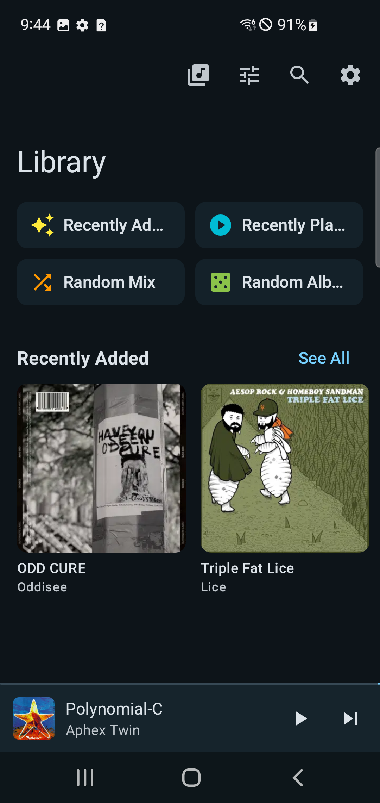
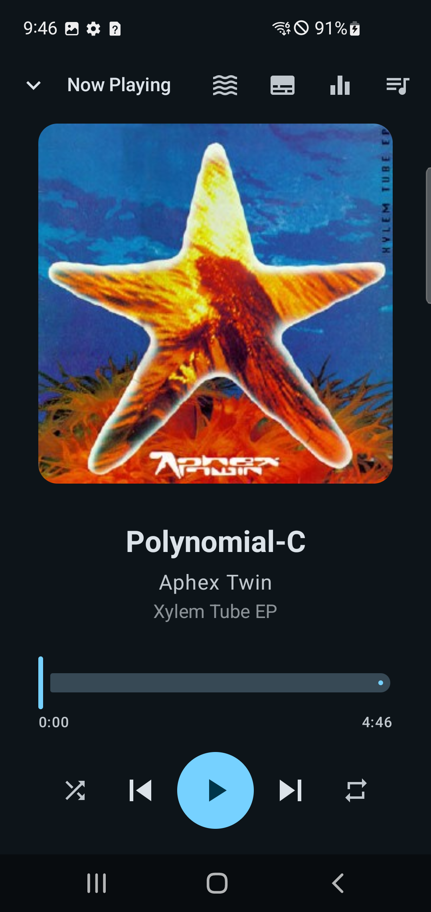
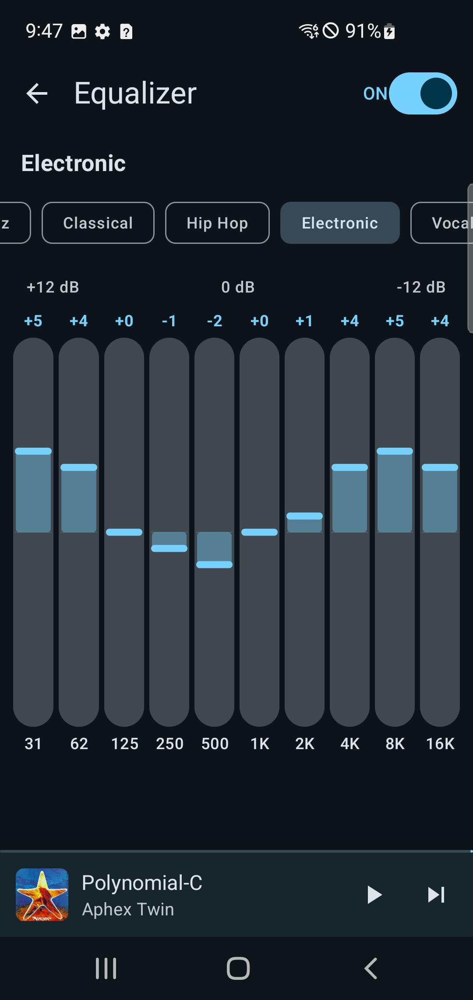
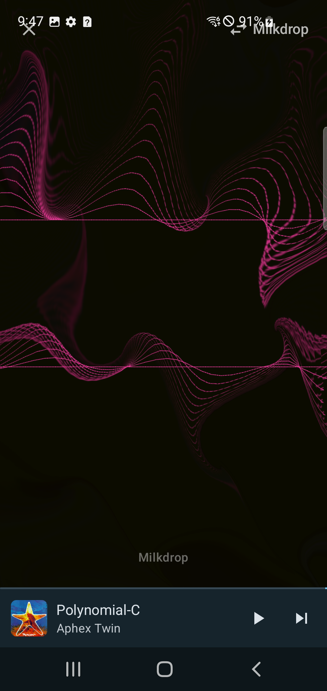
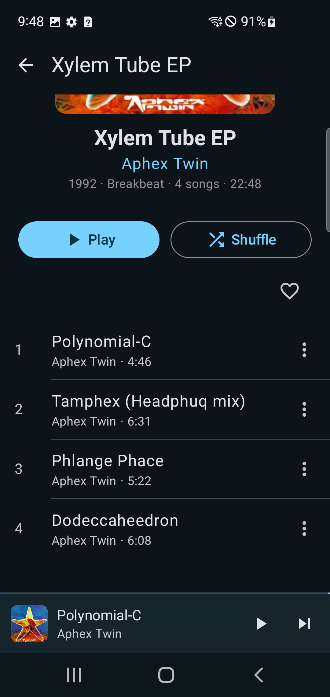
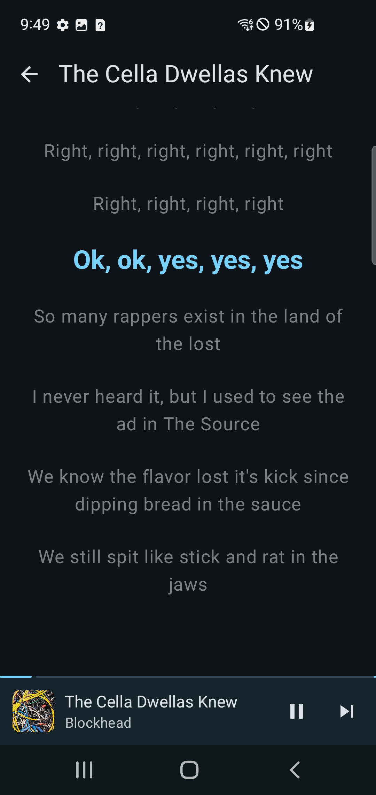
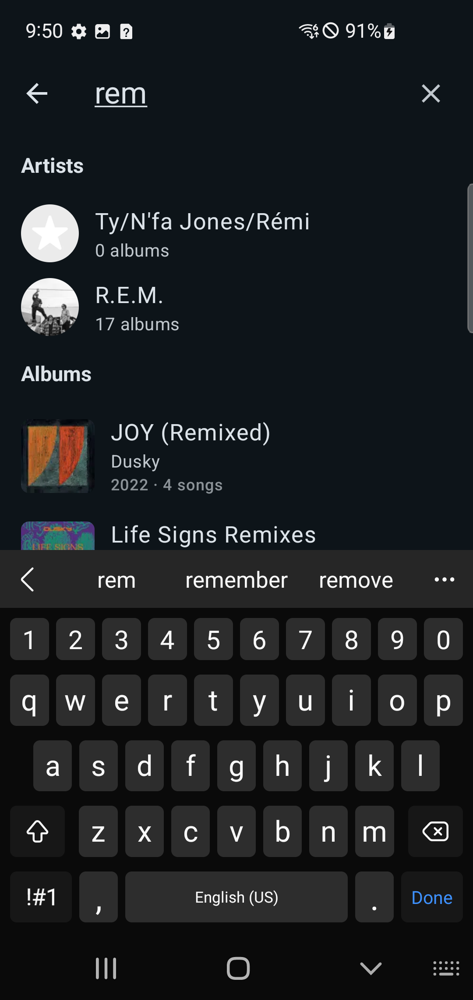
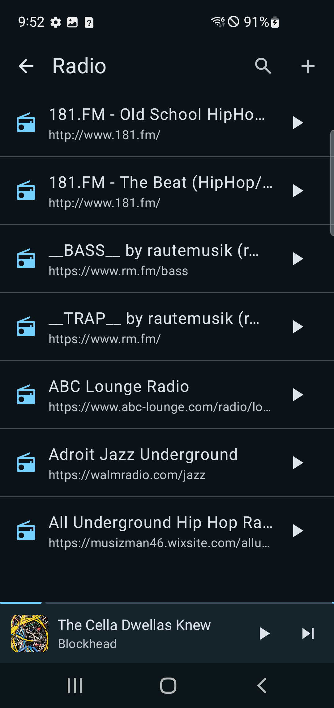

```
 _   _  _____ ______ ______ ______ ______  _____ ___  ___ _____
| | | ||_   _|| ___ \| ___ \|  _  \| ___ \|  _  ||  \/  ||  ___|
| | | |  | |  | |_/ /| |_/ /| | | || |_/ /| | | || .  . || |__
| | | |  | |  | ___ \|    / | | | ||    / | | | || |\/| ||  __|
\ \_/ / _| |_ | |_/ /| |\ \ | |/ / | |\ \ \ \_/ /| |  | || |___
 \___/  \___/ \____/ \_| \_||___/  \_| \_| \___/ \_|  |_/\____/
```

### ♪♫(◕‿◕)♫♪ *A native Android music player for Navidrome & Subsonic*

**[Download APK](https://github.com/ddmoney420/vibrdrome-android/releases) | [Website](https://vibrdrome.io) | [Discord](https://discord.gg/9q5uw3CfN)**

---

<h2 align="center">100% Vibe Coded &nbsp; ᕙ(⇀‸↼‶)ᕗ</h2>

<p align="center">
<code>human vision + AI code</code> powered by <a href="https://claude.ai/claude-code"><b>Claude Code</b></a>
</p>

---

## Screenshots

<p align="center">
  
  
  
  
</p>
<p align="center">
  
  
  
  
</p>

---

## ♪(๑ᴖ◡ᴖ๑)♪ Features

```
______  _____   ___   _____  _   _ ______  _____  _____
|  ___||  ___| / _ \ |_   _|| | | || ___ \|  ___|/  ___|
| |_   | |__  / /_\ \  | |  | | | || |_/ /| |__  \ `--.
|  _|  |  __| |  _  |  | |  | | | ||    / |  __|  `--. \
| |    | |___ | | | |  | |  | |_| || |\ \ | |___ /\__/ /
\_|    \____/ \_| |_/  \_/   \___/ \_| \_|\____/ \____/
```

### Playback ♪～(´ε｀ )
- **Gapless playback** with true dual-player crossfade (3 curve types)
- **Smart transitions** — auto gapless for albums, variable crossfade for genre shifts
- **10-band parametric EQ** with presets, AutoEQ/APO import, and per-device profiles
- **ReplayGain** (track/album/auto mode) with pre-amp and peak limiting
- **Audio normalization** for tracks without ReplayGain tags
- **Haptic feedback** synced to bass beats (3 intensity levels)
- **Immersive Mode** — visualizer + haptics + crossfade in one toggle
- **Playback speed** control (0.5x - 2.0x)
- **Sleep timer** with volume fade
- **Adaptive bitrate** — auto-adjusts quality based on network speed

### Library ♬♩♪♩
- Browse by **artists, albums, songs, genres, playlists, and folders**
- **Artist radio** and **smart playlists** (Artist Mix, Genre Mix, Similar Songs, and more)
- **Full-text search** across your entire collection
- **Synced lyrics** with tap-to-seek
- **Library folder switching** for multi-library servers

### Visualizer (ﾉ◕ヮ◕)ﾉ*:・゚
- **Milkdrop visualizer** — real projectM engine with 50+ presets
- **6 custom GLSL shaders** — audio-reactive GPU rendering
- Photosensitivity warning with accessibility controls

### Offline & Downloads (⌐■_■)
- **Download songs, albums, and playlists** for offline listening
- **Batch downloads** — download entire albums or playlists at once
- **Offline action queue** — stars and scrobbles sync when back online
- **Cache management** with configurable limits

### Platform ᕦ(ò_óˇ)ᕤ
- **Chromecast** support — cast to any Cast device
- **Jukebox Mode** — play through your server's speakers (remote control)
- **Android Auto** support with full browse tree
- **Home screen widget** — album art, controls, auto-updating
- **Internet radio** — browse, search, and add custom streams (PLS/M3U)
- **Multi-server support** with secure credential storage
- **Scrobbling** with duplicate prevention and offline queue
- **Queue sync** — resume playback across devices
- **Bookmarks** — save and resume positions
- **Listening stats** — top artists, albums, genres, streaks, activity heatmap
- **Playlist sharing** — toggle public/private for multi-user servers

### Customization ─=≡Σ((( つ◕ل͜◕)つ
- **Dark and light themes** with accent colors
- **Material You** dynamic theming
- **Customizable library** — reorder & show/hide sections

---

## (ﾉ◕ヮ◕)ﾉ*:・゚ Getting Started

### Install

Download the latest APK from [Releases](https://github.com/ddmoney420/vibrdrome-android/releases) and install it on your Android device.

### Build from Source

```bash
git clone https://github.com/ddmoney420/vibrdrome-android.git
cd vibrdrome-android
./gradlew assembleDebug
```

APK will be at `app/build/outputs/apk/debug/app-debug.apk`.

---

## (⌐■_■) Tech Stack

| Tech | What |
|------|------|
| **Kotlin** | Language |
| **Jetpack Compose** | UI framework |
| **Media3 / ExoPlayer** | Audio playback |
| **projectM** | Milkdrop visualizer |
| **Room** | Local database |
| **Ktor** | Networking |
| **EncryptedSharedPreferences** | Secure credential storage |

---

## Other Vibrdrome Apps ヽ(>∀<)ノ

| Platform | Link |
|----------|------|
| iOS / macOS | [GitHub](https://github.com/ddmoney420/vibrdrome) |
| Android | You're here! |
| Web | [web.vibrdrome.io](https://web.vibrdrome.io) / [GitHub](https://github.com/ddmoney420/vibrdrome-web) |

---

## (♥‿♥) Community

- **Website:** [vibrdrome.io](https://vibrdrome.io)
- **Discord:** [Join the server](https://discord.gg/9q5uw3CfN)
- **GitHub Issues:** [Report bugs or request features](https://github.com/ddmoney420/vibrdrome-android/issues)

---

```
_____  _____  _   _  _____ ______  _____ ______  _   _  _____  _____  _   _  _____
/  __ \|  _  || \ | ||_   _|| ___ \|_   _|| ___ \| | | ||_   _||_   _|| \ | ||  __ \
| /  \/| | | ||  \| |  | |  | |_/ /  | |  | |_/ /| | | |  | |    | |  |  \| || |  \/
| |    | | | || . ` |  | |  |    /   | |  | ___ \| | | |  | |    | |  | . ` || | __
| \__/\\ \_/ /| |\  |  | |  | |\ \  _| |_ | |_/ /| |_| |  | |   _| |_ | |\  || |_\ \
 \____/ \___/ \_| \_/  \_/  \_| \_| \___/ \____/  \___/   \_/   \___/ \_| \_/ \____/
```

Contributions are welcome! ♪♫(◕‿◕)♫♪

1. Fork the repo
2. Create a feature branch (`git checkout -b feature/my-feature`)
3. Commit your changes
4. Push to the branch and open a PR

---

## License

[MIT](LICENSE)

---

<p align="center">
  <b>Built with vibes, shipped with love</b>
  <br>
  ASCII art powered by <a href="https://github.com/ddmoney420/moji">moji</a>
  <br><br>
  <a href="https://vibrdrome.io">vibrdrome.io</a>
</p>
